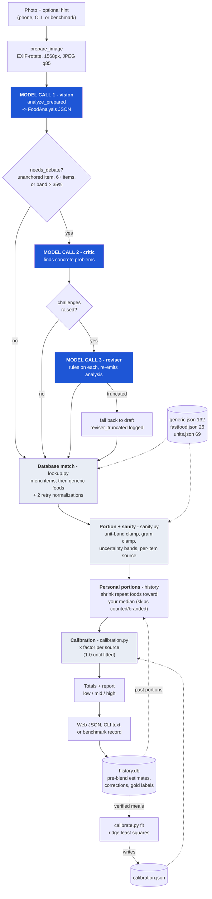
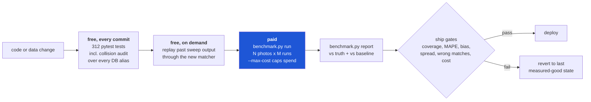

# CalorieCam — Architecture

Photo in, itemized calorie estimate out. The design principle running through
everything: **the model is used for perception, not arithmetic.** Claude
identifies food and estimates portions; every calorie number after that comes
from a database and deterministic Python that can be tested offline for free.

## Main flow

Blue = costs money (API calls). Everything else is deterministic Python and
free to run, which is why most testing happens offline.

## Cost shape

One photo = 1–3 model calls. The vision call always runs; the critic runs when
`needs_debate` says the draft is uncertain (in practice ~95% of photos); the
reviser runs only if the critic actually raised something. Measured average:
**18.8¢/photo**, dominated by output tokens, so cost scales with scene
complexity (4.9¢ for two apples, 45.6¢ for a charcuterie board).

## Validation loop

The rule that matters: **paid sweeps confirm, they don't discover.** Offline
tests and replays answer most questions for $0; the sweep exists to validate.
And **one variable per sweep** — tuning a prompt against a run that also
changed the model produced a wrong conclusion once already (see
`docs/KNOWLEDGE_BASE.md` → Known limitations).
