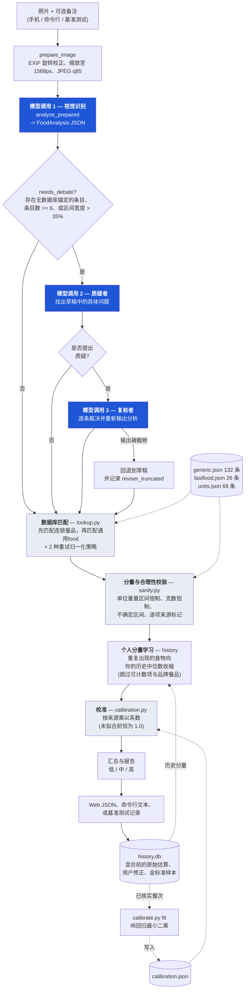
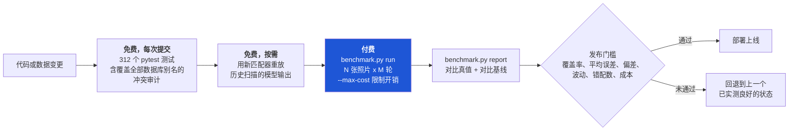

# CalorieCam — 系统架构

> [English version](ARCHITECTURE.md)

输入一张照片，输出逐项的卡路里估算。贯穿整个设计的核心原则是：
**模型只负责"看"，不负责"算"。** Claude 负责识别食物、估算分量；此后每一个
卡路里数字都来自数据库和确定性的 Python 代码，因此可以离线、零成本地测试。

## 主流程

蓝色 = 产生费用的环节（API 调用）。其余均为确定性 Python 代码，运行免费——
这也是绝大部分测试都在离线完成的原因。

## 成本构成

一张照片 = 1～3 次模型调用。视觉调用始终执行；当 `needs_debate` 判定草稿存在
不确定性时才调用质疑者（实际约 95% 的照片会触发）；只有质疑者确实提出问题时
才会调用复核者。实测均值：**每张 18.8 美分**，成本主要由输出 token 决定，因此
随画面复杂度变化（两个苹果 4.9 美分，一整块冷盘拼盘 45.6 美分）。

## 验证闭环

最关键的一条规则：**付费扫描用于"确认"，而不是用于"发现"。** 离线测试和免费
重放能以零成本回答绝大多数问题；付费扫描的存在意义是验证。以及
**每次扫描只改一个变量**——曾经有一次在同时更换了模型的扫描结果上去调提示词，
直接得出了错误结论（详见 `docs/KNOWLEDGE_BASE.zh-CN.md` → 已知限制）。
